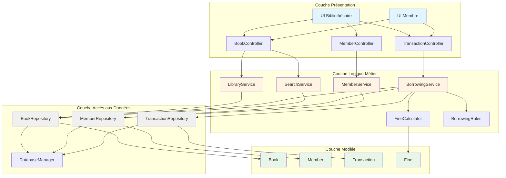
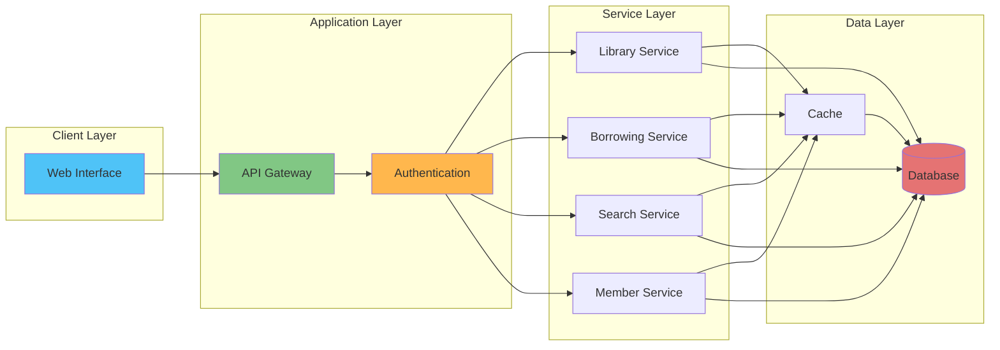

# 2. Architecture du Système

## 2.1 Vue d'Ensemble

Le système de gestion de bibliothèque suit une **architecture en couches (Layered Architecture)** pour assurer la séparation des préoccupations, la maintenabilité et l'évolutivité.

## 2.2 Composants Majeurs

### Couche 1 : Présentation (Presentation Layer)
**Responsabilité** : Interface utilisateur et interaction avec les acteurs

**Composants** :
- **UI Bibliothécaire** : Interface pour les opérations administratives
  - Gestion du catalogue
  - Gestion des membres
  - Validation des emprunts/retours
  - Génération de rapports
  
- **UI Membre** : Interface pour les utilisateurs finaux
  - Recherche de livres
  - Consultation du compte
  - Demande d'emprunt/renouvellement
  
- **Contrôleurs** : Gèrent les requêtes et coordonnent les réponses
  - BookController
  - MemberController
  - TransactionController

### Couche 2 : Logique Métier (Business Logic Layer)
**Responsabilité** : Implémentation des règles métier et orchestration

**Composants** :
- **Services Métier** :
  - `LibraryService` : Orchestration générale
  - `BorrowingService` : Logique d'emprunt/retour
  - `SearchService` : Recherche et filtrage
  - `MemberService` : Gestion des membres
  - `FineCalculator` : Calcul des amendes

- **Gestionnaires de Règles** :
  - `BorrowingRules` : Validation des règles d'emprunt
  - `ValidationService` : Validation des données

### Couche 3 : Accès aux Données (Data Access Layer)
**Responsabilité** : Persistance et récupération des données

**Composants** :
- **Repositories** :
  - `BookRepository` : CRUD pour les livres
  - `MemberRepository` : CRUD pour les membres
  - `TransactionRepository` : CRUD pour les transactions
  
- **Gestionnaire de Base de Données** :
  - `DatabaseManager` : Connexion et transactions

### Couche 4 : Modèle de Données (Domain Model)
**Responsabilité** : Entités métier et leurs relations

**Composants** :
- **Entités** :
  - `Book` : Représentation d'un livre
  - `Member` : Représentation d'un membre
  - `Librarian` : Représentation d'un bibliothécaire
  - `Transaction` : Représentation d'une transaction d'emprunt
  - `Fine` : Représentation d'une amende

## 2.3 Diagramme d'Architecture en Couches

## 2.4 Flux d'Interaction : Scénario "Emprunter un Livre"

### Description Textuelle

1. **Membre** → UI Membre : Sélectionne un livre et demande l'emprunt
2. **UI Membre** → TransactionController : Envoie requête d'emprunt
3. **TransactionController** → BorrowingService : Appelle `borrowBook(memberId, bookId)`
4. **BorrowingService** → BorrowingRules : Valide les règles métier
   - Vérifie que le membre peut emprunter
   - Vérifie que le livre est disponible
   - Vérifie les limites d'emprunt
5. **BorrowingRules** → MemberRepository : Récupère les infos du membre
6. **BorrowingRules** → BookRepository : Récupère les infos du livre
7. **BorrowingService** → TransactionRepository : Crée une nouvelle transaction
8. **BorrowingService** → BookRepository : Met à jour le statut du livre
9. **TransactionController** → UI Membre : Confirme l'emprunt avec date de retour

### Principes Appliqués

- **Séparation des préoccupations** : Chaque couche a sa responsabilité unique
- **Couplage faible** : Les couches communiquent via des interfaces
- **Cohésion forte** : Les composants d'une même couche travaillent ensemble
- **Flux unidirectionnel** : Les dépendances vont de haut en bas

## 2.5 Diagramme de Composants

## 2.6 Patterns Architecturaux Utilisés

### 2.6.1 Repository Pattern
- Abstraction de la couche de persistance
- Facilite les tests unitaires (mock repositories)
- Permet de changer de technologie de stockage sans impacter la logique métier

### 2.6.2 Service Layer Pattern
- Encapsule la logique métier complexe
- Coordonne les opérations entre plusieurs repositories
- Applique les règles métier

### 2.6.3 MVC (Model-View-Controller)
- **Model** : Entités du domaine (Book, Member, Transaction)
- **View** : Interfaces utilisateur (UI Bibliothécaire, UI Membre)
- **Controller** : Coordonne les requêtes (BookController, etc.)

### 2.6.4 Dependency Injection
- Les services reçoivent leurs dépendances via le constructeur
- Facilite les tests et la maintenance
- Réduit le couplage

## 2.7 Considérations de Sécurité

### Authentification et Autorisation
- **Authentification** : Vérification de l'identité (login/password)
- **Autorisation** : Contrôle des droits d'accès par rôle
  - Bibliothécaire : Accès complet
  - Membre : Accès restreint aux opérations personnelles

### Validation des Données
- Validation côté client (UI) pour l'expérience utilisateur
- Validation côté serveur (Service Layer) pour la sécurité
- Sanitization des entrées pour prévenir les injections

## 2.8 Extensibilité

L'architecture permet facilement :
- Ajout de nouveaux types de médias (DVD, magazines)
- Intégration d'un système de réservation
- Ajout de notifications (email, SMS)
- Intégration d'API externes (catalogues en ligne)
- Ajout de nouvelles règles métier sans impact majeur

## 2.9 Performances et Optimisation

### Cache
- Mise en cache des livres fréquemment consultés
- Cache des résultats de recherche populaires

### Indexation
- Index sur ISBN, titre, auteur pour recherches rapides
- Index sur memberId pour récupération rapide des emprunts

### Pagination
- Limitation du nombre de résultats retournés
- Chargement progressif pour grandes listes
