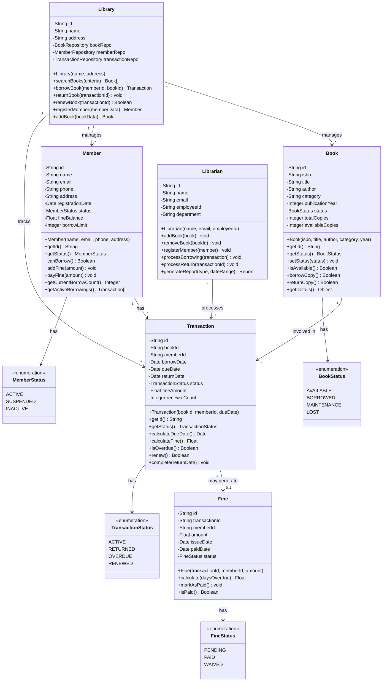
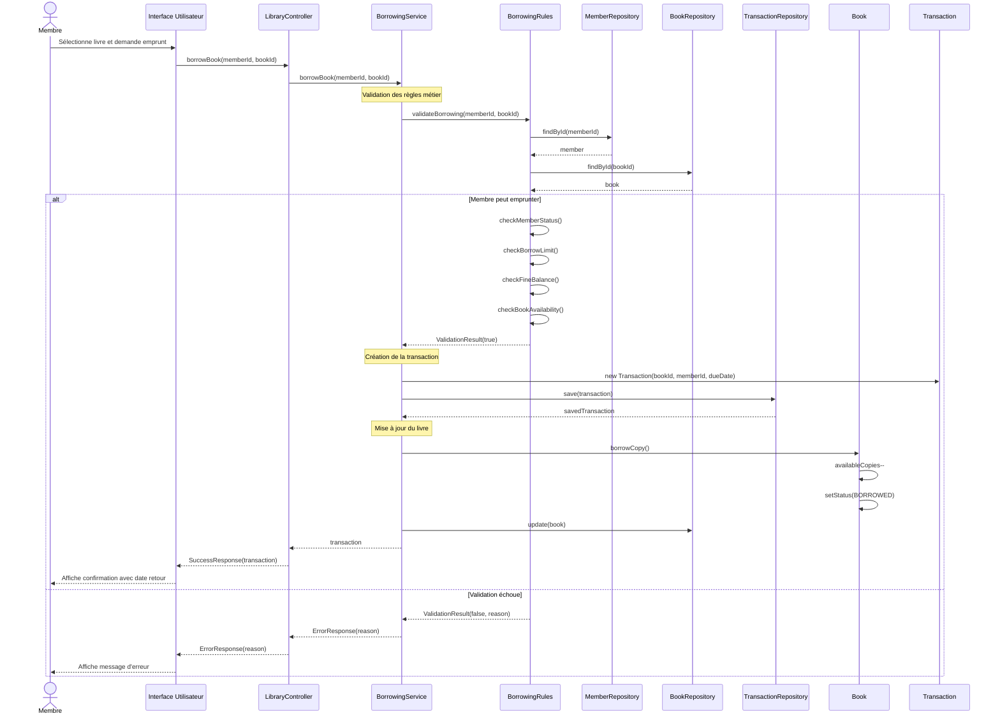
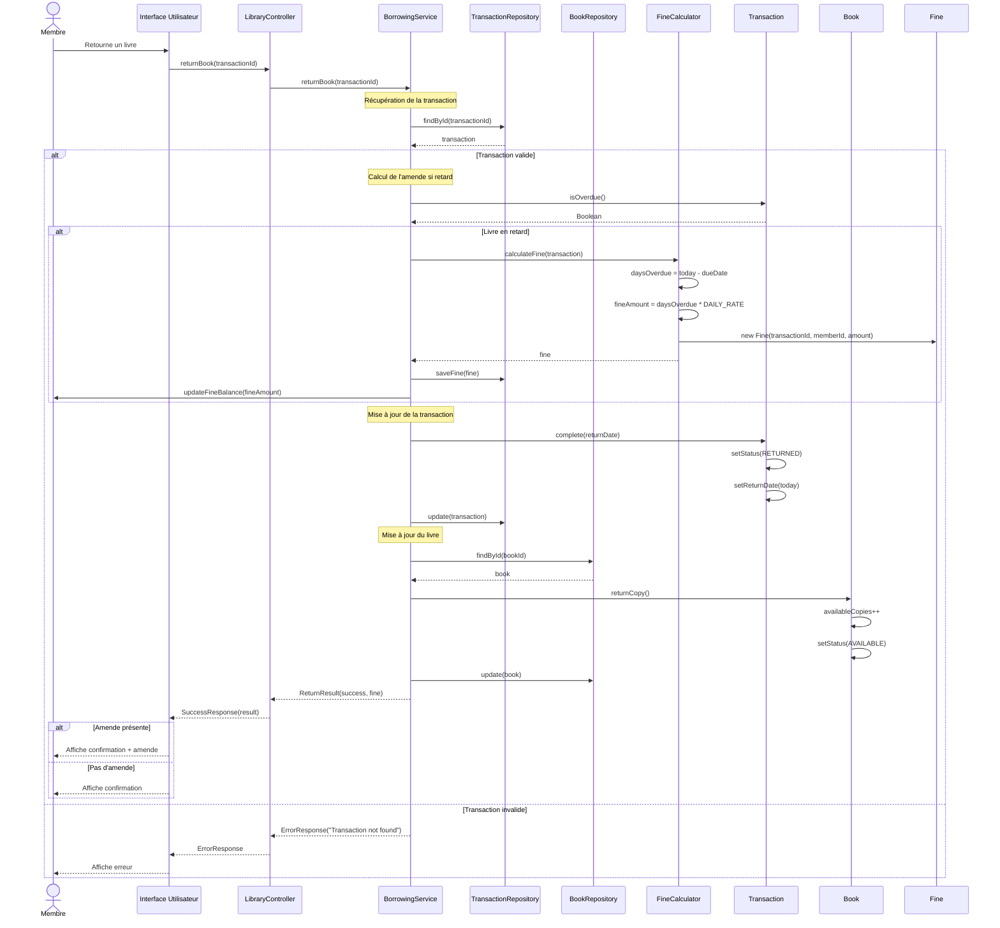
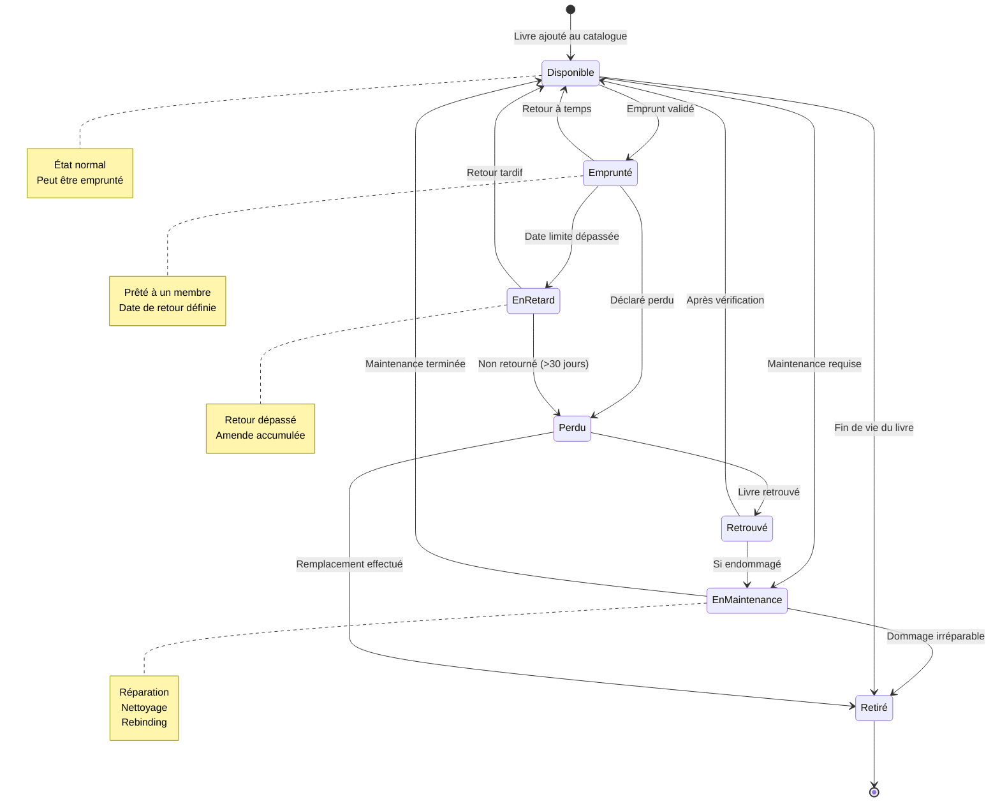
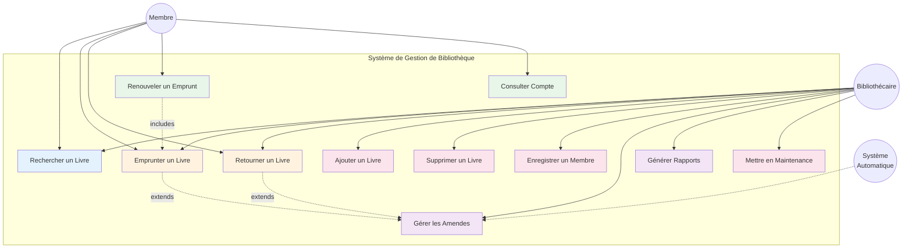

# 3. Modélisation UML - Analyse Orientée Objet

## 3.1 Diagramme de Classes

Le diagramme de classes représente la structure statique du système, identifiant les classes principales, leurs attributs, méthodes et relations.

### Principes Respectés

**1. Responsabilité Unique (SRP)** :
- `Book` : Gère uniquement les informations et états du livre
- `Member` : Gère uniquement les informations du membre
- `Transaction` : Gère uniquement une opération d'emprunt/retour
- `Fine` : Gère uniquement les amendes

**2. Encapsulation** :
- Attributs privés (-)
- Accès via getters/setters publics (+)
- Validation dans les méthodes

**3. Cohésion** :
- Chaque classe regroupe des données et méthodes fortement liées

## 3.2 Diagramme de Séquence : Emprunter un Livre

### Points Clés du Flux
1. **Validation rigoureuse** avant toute modification
2. **Transaction atomique** : Si une étape échoue, rien n'est modifié
3. **Mise à jour cohérente** : Transaction créée + Livre mis à jour
4. **Feedback utilisateur** : Confirmation ou message d'erreur clair

## 3.3 Diagramme de Séquence : Retourner un Livre

### Points Clés du Flux
1. **Vérification de la transaction** existante
2. **Calcul automatique des amendes** si retard
3. **Mise à jour cohérente** : Transaction + Livre + Membre
4. **Notification des amendes** à l'utilisateur

## 3.4 Diagramme d'État : Cycle de Vie d'un Livre

### États du Livre

| État | Description | Peut être emprunté ? | Actions possibles |
|------|-------------|---------------------|-------------------|
| **Disponible** | Livre disponible à l'emprunt | ✅ Oui | Emprunter, Mettre en maintenance |
| **Emprunté** | Livre prêté à un membre | ❌ Non | Retourner, Déclarer perdu |
| **En Retard** | Livre non retourné à temps | ❌ Non | Retourner (avec amende) |
| **En Maintenance** | Livre en réparation/entretien | ❌ Non | Remettre en service, Retirer |
| **Perdu** | Livre déclaré perdu | ❌ Non | Retrouver, Retirer |
| **Retrouvé** | Livre perdu qui a été retrouvé | ❌ Non | Vérifier état |
| **Retiré** | Livre retiré de la collection | ❌ Non | Aucune |

### Transitions et Événements

- **Ajout au catalogue** : `[*] → Disponible`
- **Emprunt** : `Disponible → Emprunté`
- **Retour** : `Emprunté → Disponible`
- **Dépassement délai** : `Emprunté → En Retard` (automatique)
- **Maintenance** : `Disponible → En Maintenance`
- **Perte** : `Emprunté/En Retard → Perdu`
- **Découverte** : `Perdu → Retrouvé`
- **Retrait** : `Disponible/Perdu/En Maintenance → Retiré`

## 3.5 Diagramme de Cas d'Utilisation

## 3.6 Relations et Cardinalités

### Relations Principales

1. **Library - Book** : `1..* (un à plusieurs)`
   - Une bibliothèque gère plusieurs livres
   - Un livre appartient à une bibliothèque

2. **Library - Member** : `1..* (un à plusieurs)`
   - Une bibliothèque a plusieurs membres
   - Un membre est inscrit dans une bibliothèque

3. **Member - Transaction** : `1..* (un à plusieurs)`
   - Un membre peut avoir plusieurs emprunts
   - Une transaction appartient à un membre

4. **Book - Transaction** : `1..* (un à plusieurs)`
   - Un livre peut avoir plusieurs transactions (historique)
   - Une transaction concerne un livre

5. **Transaction - Fine** : `1..0..1 (un à zéro ou un)`
   - Une transaction peut générer une amende
   - Une amende est liée à une transaction

### Contraintes d'Intégrité

- Un membre ne peut pas emprunter plus de 5 livres simultanément
- Un livre ne peut pas être emprunté s'il n'est pas disponible
- Une transaction ne peut pas être créée si le membre a des amendes > 10€
- La date de retour doit être postérieure à la date d'emprunt
