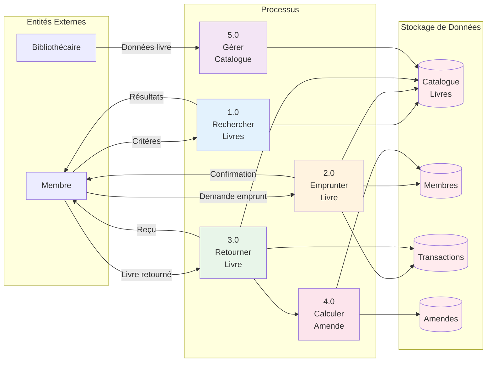
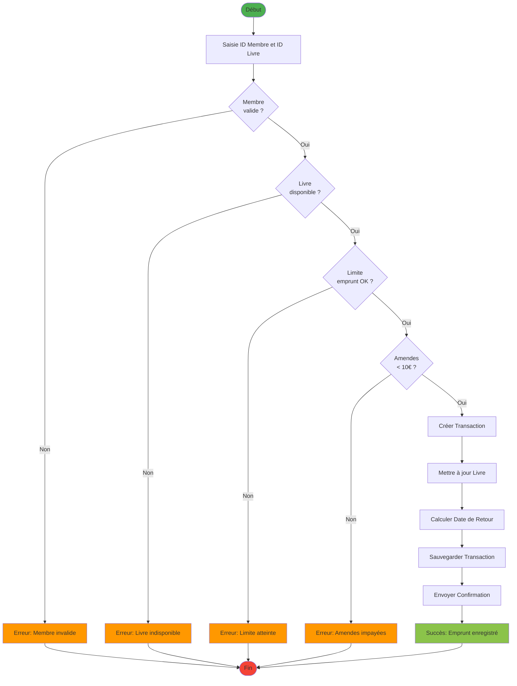
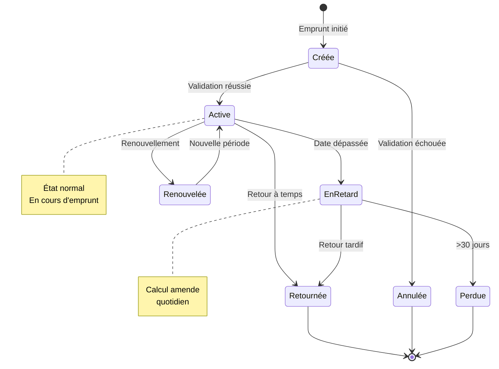
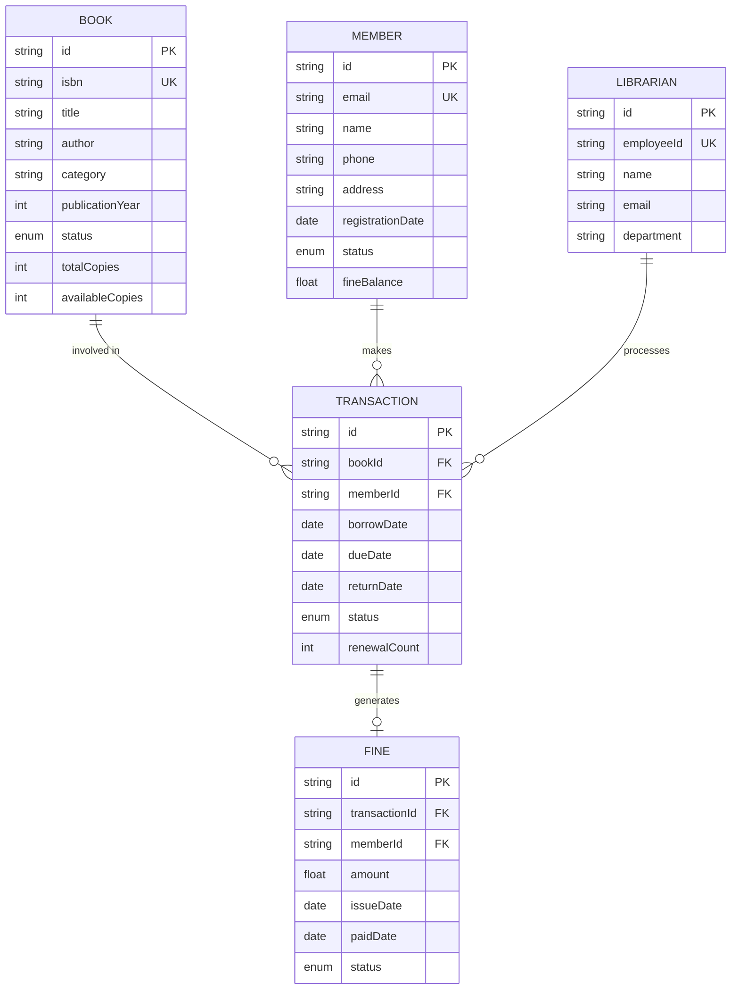
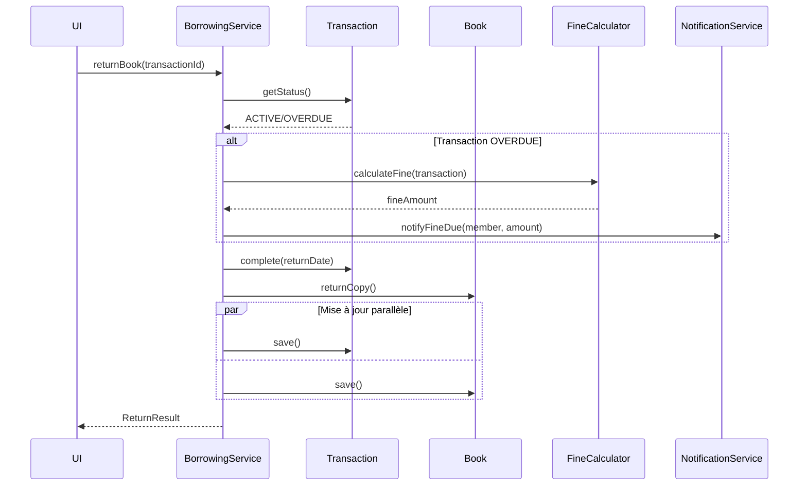

# 4. Modélisation des Données et du Comportement

## 4.1 Vue d'Ensemble

La modélisation d'un système complexe nécessite deux perspectives complémentaires :

- **Modèle Fonctionnel** : *Que fait le système ?* (Transformations de données)
- **Modèle Comportemental** : *Comment réagit-il dans le temps ?* (États et transitions)

## 4.2 Modèle Fonctionnel

### 4.2.1 Définition

Le modèle fonctionnel décrit **ce que fait le système** en termes de transformations de données et de traitements. Il se concentre sur les fonctions et opérations sans considérer le temps ou l'ordre d'exécution.

### 4.2.2 Fonctions Principales du Système

#### 1. Fonction de Recherche
**Entrée** : Critères de recherche (titre, auteur, ISBN, catégorie)  
**Traitement** :
- Interrogation de la base de données
- Application des filtres
- Tri des résultats par pertinence

**Sortie** : Liste de livres correspondants avec leur statut

**Algorithme** :
```
FONCTION rechercherLivres(critères):
    livres ← obtenirTousLesLivres()
    résultats ← LISTE_VIDE
    
    POUR CHAQUE livre DANS livres:
        SI correspondCritères(livre, critères):
            résultats.AJOUTER(livre)
    FIN POUR
    
    résultats ← trierParPertinence(résultats)
    RETOURNER résultats
FIN FONCTION
```

#### 2. Fonction d'Emprunt
**Entrée** : ID Membre, ID Livre  
**Traitement** :
- Validation des règles métier
- Création de la transaction
- Mise à jour du statut du livre
- Calcul de la date de retour

**Sortie** : Transaction créée ou message d'erreur

**Algorithme** :
```
FONCTION emprunterLivre(idMembre, idLivre):
    membre ← obtenirMembre(idMembre)
    livre ← obtenirLivre(idLivre)
    
    // Validation
    SI NON estValide(membre, livre):
        RETOURNER ERREUR("Emprunt non autorisé")
    FIN SI
    
    // Création transaction
    dateRetour ← aujourdHui() + DUREE_EMPRUNT
    transaction ← NOUVELLE Transaction(idMembre, idLivre, dateRetour)
    
    // Mise à jour
    livre.statut ← EMPRUNTÉ
    livre.exemplairesDisponibles ← livre.exemplairesDisponibles - 1
    
    sauvegarder(transaction)
    sauvegarder(livre)
    
    RETOURNER transaction
FIN FONCTION
```

#### 3. Fonction de Retour
**Entrée** : ID Transaction  
**Traitement** :
- Vérification de la transaction
- Calcul de l'amende si retard
- Mise à jour du livre
- Clôture de la transaction

**Sortie** : Résultat du retour avec amende éventuelle

**Algorithme** :
```
FONCTION retournerLivre(idTransaction):
    transaction ← obtenirTransaction(idTransaction)
    livre ← obtenirLivre(transaction.idLivre)
    
    // Calcul amende
    joursRetard ← max(0, aujourdHui() - transaction.dateRetour)
    amende ← joursRetard * TARIF_JOURNALIER
    
    SI amende > 0:
        créerAmende(transaction.idMembre, amende)
        membre ← obtenirMembre(transaction.idMembre)
        membre.soldeAmende ← membre.soldeAmende + amende
        sauvegarder(membre)
    FIN SI
    
    // Mise à jour
    livre.statut ← DISPONIBLE
    livre.exemplairesDisponibles ← livre.exemplairesDisponibles + 1
    transaction.statut ← RETOURNÉ
    transaction.dateRetourEffective ← aujourdHui()
    
    sauvegarder(livre)
    sauvegarder(transaction)
    
    RETOURNER {succès: VRAI, amende: amende}
FIN FONCTION
```

#### 4. Fonction de Calcul d'Amende
**Entrée** : Transaction  
**Traitement** :
- Calcul des jours de retard
- Application du tarif journalier
- Plafonnement éventuel

**Sortie** : Montant de l'amende

**Formule** :
$$
\text{Amende} = \max(0, (\text{Date Actuelle} - \text{Date Retour}) \times \text{Tarif Journalier})
$$

Avec plafonnement :
$$
\text{Amende Finale} = \min(\text{Amende}, \text{Plafond Maximum})
$$

### 4.2.3 Diagramme de Flux de Données (DFD)



## 4.3 Modèle Comportemental

### 4.3.1 Définition

Le modèle comportemental décrit **comment le système réagit dans le temps** aux événements externes et internes. Il se concentre sur les états, les transitions et les réactions temporelles.

### 4.3.2 Comportement Temporel du Système

#### Événements Temporels

1. **Vérification quotidienne des retards**
   - **Déclencheur** : Horloge système (00:00 chaque jour)
   - **Action** :
     - Parcourir toutes les transactions actives
     - Identifier celles dont la date de retour est dépassée
     - Changer le statut à "EN_RETARD"
     - Calculer et enregistrer l'amende quotidienne

```
PROCESSUS vérificationQuotidienne():
    transactionsActives ← obtenirTransactionsActives()
    
    POUR CHAQUE transaction DANS transactionsActives:
        SI aujourdHui() > transaction.dateRetour:
            transaction.statut ← EN_RETARD
            livre ← obtenirLivre(transaction.idLivre)
            livre.statut ← EN_RETARD
            
            joursRetard ← aujourdHui() - transaction.dateRetour
            amende ← joursRetard * TARIF_JOURNALIER
            
            mettreÀJourAmende(transaction.idMembre, amende)
        FIN SI
    FIN POUR
FIN PROCESSUS
```

2. **Rappels automatiques**
   - **J-3** : Email de rappel avant échéance
   - **J+1** : Notification de retard
   - **J+7** : Alerte bibliothécaire

#### Diagramme d'Activité : Processus d'Emprunt Complet



### 4.3.3 Comportement des Objets Métier

#### Cycle de Vie d'une Transaction



### 4.3.4 Comportement Réactif aux Événements

| Événement | Objet Affecté | Réaction | Nouvelle Action |
|-----------|---------------|----------|-----------------|
| Emprunt validé | Livre | `statut → EMPRUNTÉ` | Créer transaction |
| Retour effectué | Livre | `statut → DISPONIBLE` | Clôturer transaction |
| Date dépassée | Transaction | `statut → EN_RETARD` | Calculer amende |
| Amende > 10€ | Membre | `statut → SUSPENDU` | Bloquer emprunts |
| Paiement amende | Membre | `soldeAmende - montant` | Débloquer si < 10€ |
| Livre perdu | Livre | `statut → PERDU` | Facturer remplacement |

### 4.3.5 Règles de Cohérence Temporelle

1. **Contrainte d'ordre** :
   - Une transaction ne peut être retournée avant d'être créée
   - `dateRetourEffective >= dateEmprunt`

2. **Contrainte de durée** :
   - La durée d'emprunt ne peut excéder la limite
   - `dateRetour <= dateEmprunt + DUREE_MAX`

3. **Contrainte de synchronisation** :
   - Si Transaction est ACTIVE, alors Livre doit être EMPRUNTÉ
   - Cohérence entre états liés

## 4.4 Modèle de Données Persistant

### 4.4.1 Schéma Entité-Relation



### 4.4.2 Contraintes d'Intégrité Référentielle

1. **Cascade sur suppression** :
   - Si MEMBER supprimé → Ses FINE sont conservées (historique)
   - Si BOOK supprimé → Ses TRANSACTION sont conservées (audit)

2. **Contraintes de clé** :
   - ISBN unique par livre
   - Email unique par membre
   - EmployeeId unique par bibliothécaire

3. **Contraintes de domaine** :
   - `availableCopies <= totalCopies`
   - `fineBalance >= 0`
   - `renewalCount <= 2`

## 4.5 Synchronisation Modèle Fonctionnel et Comportemental

### Exemple : Emprunt de Livre

**Aspect Fonctionnel** :
- Transformation : `(membre, livre, date) → transaction`
- Calcul : `dateRetour = dateEmprunt + 14 jours`

**Aspect Comportemental** :
- Livre : `DISPONIBLE → EMPRUNTÉ`
- Transaction : `[*] → CRÉÉE → ACTIVE`
- Événement temporel : Si date dépassée → `ACTIVE → EN_RETARD`

**Cohérence** :
- Les deux modèles doivent être synchronisés
- Une transition d'état déclenche une transformation de données
- Une opération fonctionnelle produit un changement d'état

## 4.6 Modèle de Traitement en Temps Réel

### Diagramme de Collaboration : Retour de Livre



## 4.7 Conclusion

### Forces du Modèle

✅ **Séparation claire** entre "quoi" (fonctionnel) et "comment" (comportemental)  
✅ **Traçabilité** complète des opérations et états  
✅ **Cohérence** maintenue entre les transformations et les transitions  
✅ **Évolutivité** facilitée par la modularité

### Application Pratique

Le modèle fonctionnel guide l'implémentation des **services** et **repositories**, tandis que le modèle comportemental guide l'implémentation des **machines à états** et **gestionnaires d'événements**.
